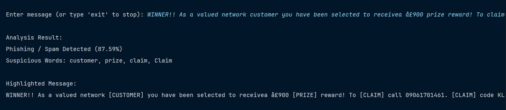
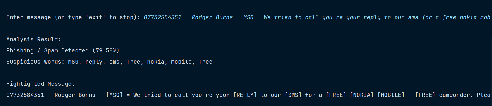

#  Spam / Phishing Detection System

A Machine Learning-based system to detect spam and phishing messages using Natural Language Processing (NLP) techniques. This project not only classifies messages but also provides **explainable insights** such as suspicious words and malicious links.

---

## **Screenshots**



##  Features
*  **Spam / Ham Classification**: Uses Naive Bayes to categorize messages.
*  **Fraud Probability Score**: Provides a percentage-based risk assessment.
*  **URL Detection**: Identifies potentially malicious phishing links using Regex.
* ️ **Suspicious Word Highlighting**: Visually flags high-risk tokens within the message.
*  **TF-IDF + Naive Bayes Model**: Efficiently handles text vectorization and classification.
*  **Model Saving using Pickle**: Saves the trained model for instant reuse.
*  **Interactive User Input Mode**: Real-time testing via the command line.

---

## ️ Tech Stack
* **Programming Language**: Python
* **Libraries Used**: `pandas`, `scikit-learn`, `re`, `pickle`

---

##  Project Structure
```text
spam-detection/
│── spam.csv           # Raw dataset
│── spam_model.pkl     # Saved trained model
│── vectorizer.pkl     # Saved TF-IDF vectorizer
│── main.py            # Main application script
│── README.md          # Project documentation
```

---

##  Installation

### 1. Clone the Repository
```bash
git clone [Link](https://github.com/NeerajKumarYadav930574/email-phising-detector)
cd spam-detection
```

### 2. Install Dependencies
```bash
pip install pandas scikit-learn
```

---

##  Usage
Run the Python script:
```bash
python main.py
```

**Example Interaction:**
> Enter message: Congratulations! You won a free iPhone. Click here: http://spam.com

---


## 🧾 Example Output
**Analysis Result:**
* **Status**: Phishing / Spam Detected (92.5%)
* **Suspicious Words**: free, won
* **Suspicious Links Detected**: http://spam.com

**Highlighted Message:**
`[CONGRATULATIONS]! You [WON] a [FREE] iPhone. Click here: [LINK:http://spam.com]`

---

##  How It Works
1. **Data Preprocessing**: Cleans the dataset, renames columns, and converts labels (ham → 0, spam → 1).
2. **Feature Extraction**: Uses **TF-IDF Vectorization** with unigrams and bigrams while removing stopwords.
3. **Model Training**: Employs the **Multinomial Naive Bayes** algorithm on an 80/20 data split.
4. **Additional Analysis**: Detects URLs using regex and highlights suspicious words based on model feature importance.

---

##  Model Performance
* **Accuracy**: ~95–98% (depends on dataset split)
* **Evaluation Metrics**: Precision, Recall, F1-score, and Confusion Matrix.

